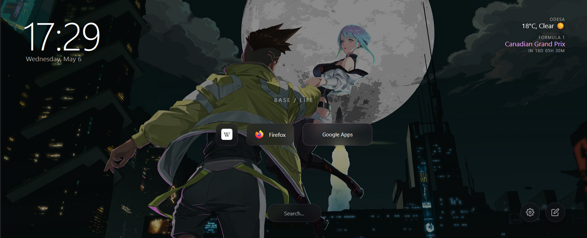
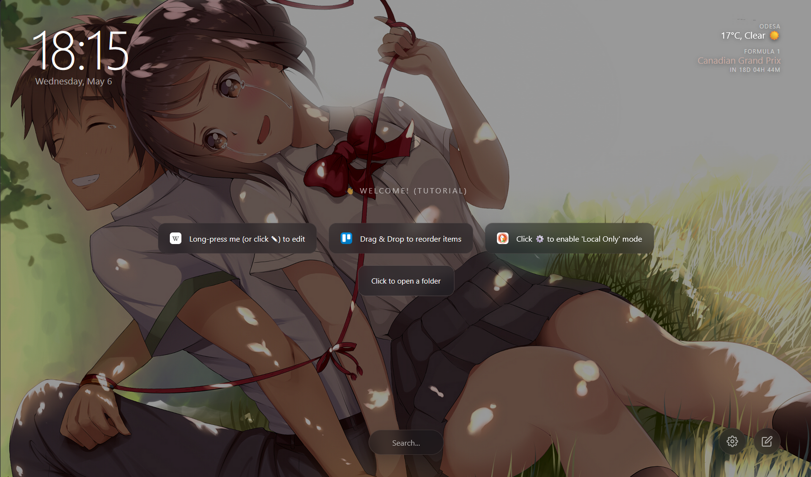
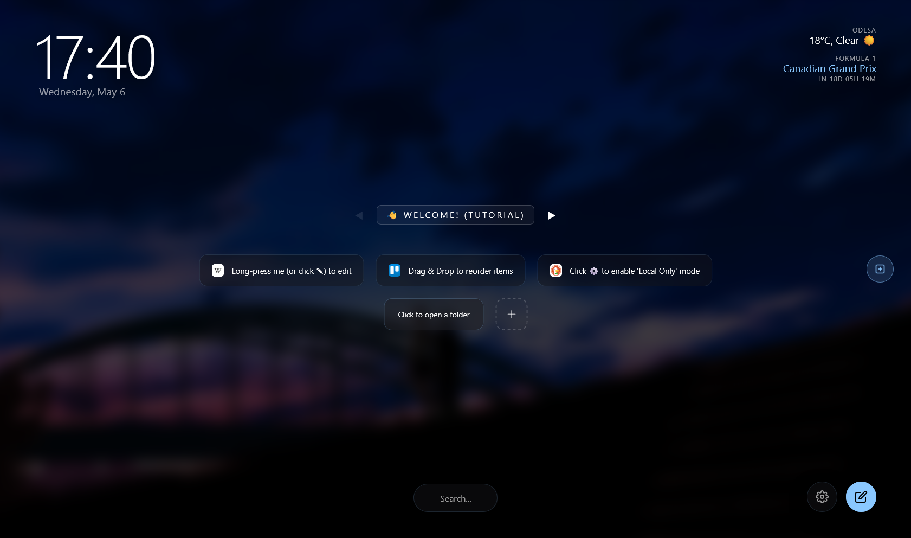
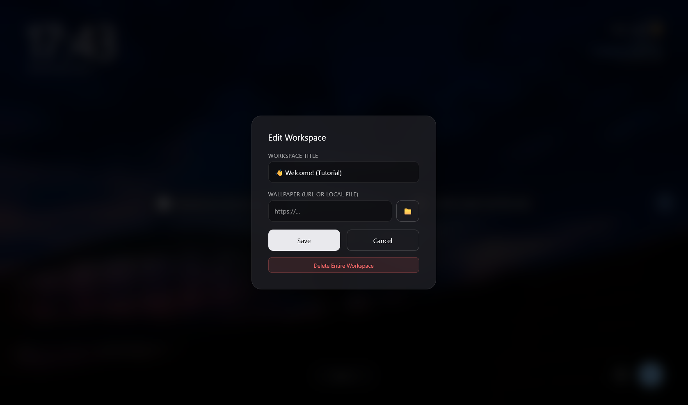
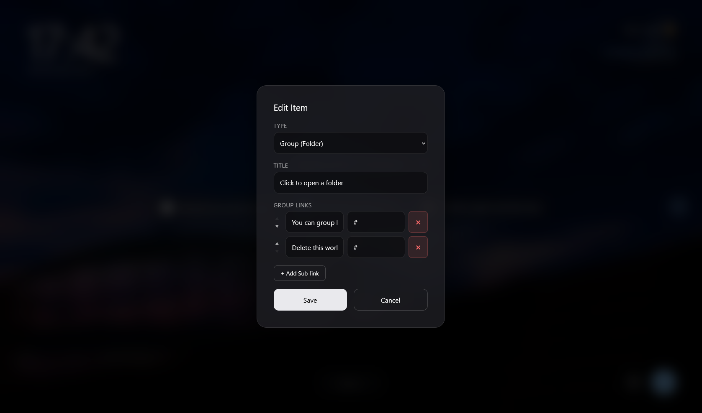
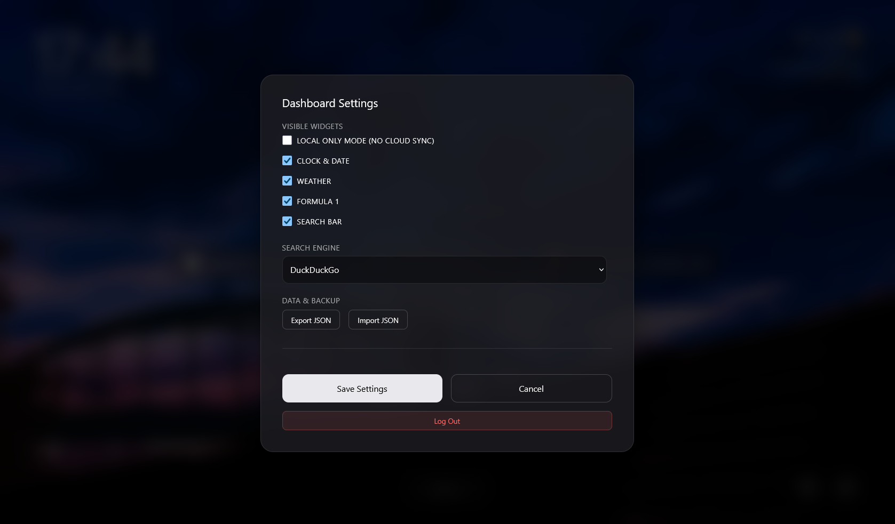

<div align="center">
  

  # HomeSpace - Custom Browser Start Page & Dashboard

  [](LICENSE)
  []()
  []()
</div>

<br>

A highly customizable, interactive, and privacy-focused Browser Start Page built to be your ultimate daily workspace. Initially created as a personal dashboard, it has evolved into a feature-rich environment perfect for r/startpages enthusiasts, r/selfhosted lovers, and anyone who wants complete control over their browser experience.

Whether you want a zero-server local setup or a fully synced cloud dashboard across all your devices, this project has you covered!

## ✨ Features

* **🔒 Two Operation Modes:**
  * **Local Only Mode (Privacy First):** Runs 100% in your browser. All data is securely saved to `localStorage`. You can easily export and import your configuration via JSON. No server, no tracking.
  * **☁️ Cloud Sync Mode:** Optional PHP backend allows you to seamlessly sync your dashboard state across multiple devices.
* **🖱️ Interactive UI:** Full Drag & Drop support for bookmarks and folders. Organize your links intuitively!
* **🗂️ Workspaces:** Support for multiple tabs/workspaces. Keep your "Daily" browsing separate from your "Work" or "Creator" links.
* **🎨 Deep Customization:** 
  * Upload your own custom backgrounds or choose from built-in anime wallpapers. 
  * **Smart Theming:** The UI automatically extracts the average color from your active background and applies it as a dynamic accent color across the dashboard.
* **🧩 Smart Widgets:** Includes built-in widgets for a Clock, Weather (powered by Open-Meteo), an F1 Next Race Countdown, and a Multi-Engine Search Bar (DuckDuckGo, Google, etc.).
* **📂 Group Links:** Group your links into clean, organized dropdown folders to reduce clutter.

## 📸 Screenshots











## 🚀 Getting Started

This dashboard is designed to be incredibly easy to set up. Choose the option that best fits your needs:

### Option A: Local / Static (No Server Required)
Perfect if you want a fast, privacy-first, local-only dashboard.

1. Clone or download the repository:
   ```bash
   git clone https://github.com/OlehShashkevych/Browser-Custom-Homepage.git
   ```
2. Open the project folder and simply double-click `index.html` to open it in your browser.
3. *Alternative:* Host it for free on GitHub Pages, Vercel, or Netlify. Since it's pure HTML/CSS/JS, it works anywhere!

### Option B: Self-Hosted with Cloud Sync (PHP Required)
Perfect if you want to sync your configuration and links across multiple devices.

1. Clone the repository to your web server (Apache, Nginx, etc.) that supports PHP.
2. **Database Setup:**
   * Create a new MySQL/MariaDB database.
   * Import the provided `inc/database.sql` file into your database to create the required tables.
3. Navigate to the `inc/` directory.
4. Rename the configuration file:
   ```bash
   mv inc/config.example.php inc/config.php
   ```
5. Open `inc/config.php` and configure your database credentials.
6. Access the dashboard through your web server's domain or local IP. The custom JSON API will automatically handle authentication and state saving.

## 🛠️ Tech Stack

* **Frontend:** HTML5, CSS3, Vanilla JavaScript
* **Backend (Optional):** PHP (Custom JSON API for auth & state saving)

## 👨‍💻 Author

Created with ❤️ by **Oleh Shashkevych**

* GitHub: [@OlehShashkevych](https://github.com/OlehShashkevych)
* Website: [shashkevych.com](https://shashkevych.com)
* Live Demo: [home.shashkevych.com](https://home.shashkevych.com/)

## 🤝 Contributing

Contributions, issues, and feature requests are always welcome! Feel free to check the [issues page](https://github.com/OlehShashkevych/Browser-Custom-Homepage/issues) if you want to contribute.

If you like this project, please consider giving it a ⭐️!
